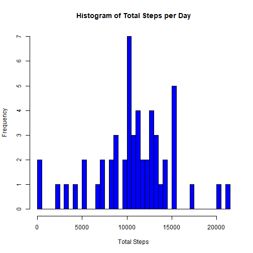
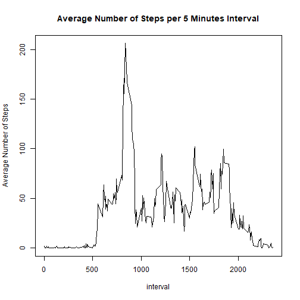
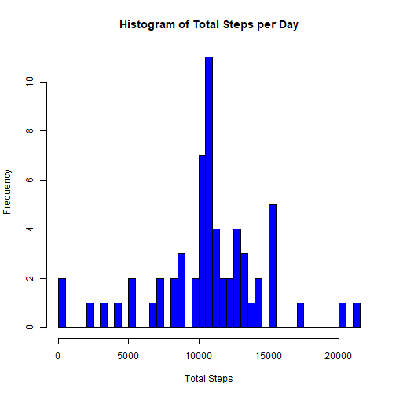
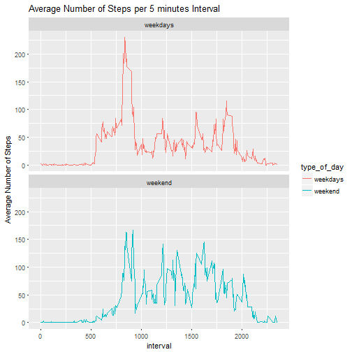

Peer-graded Assignment:Course project1 
======================================
# Course 5:Reproducible Research

## Data Used
The data for this assignment comes from a personal activity monitoring device. This device collects data at 5 minute intervals through out the day. The data consists of two months of data from an anonymous individual collected during the months of October and November, 2012 and include the number of steps taken in 5 minute intervals each day.

The variables included in this data set are:

steps: Number of steps taking in a 5-minute interval (missing values are coded as NA)

date: The date on which the measurement was taken in YYYY-MM-DD format

interval: Identifier for the 5-minute interval in which measurement was taken

## Questions-topics to be answered-completed

For the project the following questions-topics must be answered-completed:

### 1.Loading and preprocessing the data
  
  a Load the data (i.e. read.csv())
  
  b Process/transform the data (if necessary) into a format suitable for your analysis
  
### 2.What is mean total number of steps taken per day?

 a Calculate the total number of steps taken per day

 b Make a histogram of the total number of steps taken each day
  
  c Calculate and report the mean and median of the total number of steps taken per day
  
### 3.What is the average daily activity pattern?

 a Make a time series plot (i.e. type = "l") of the 5-minute interval (x-axis) and the average number of steps taken, averaged across all days (y-axis)
 
 b Which 5-minute interval, on average across all the days in the data set, contains the maximum number of steps?
 
### 4.Imputing missing values
 
 a Calculate and report the total number of missing values in the data set (i.e. the total number of rows with NAs)
 
 b Devise a strategy for filling in all of the missing values in the data set. The strategy does not need to be sophisticated. For example, you could use the mean/median for that day, or the mean for that 5-minute interval, etc.
 
 c Create a new data set that is equal to the original data set but with the missing data filled in.
 
 d Make a histogram of the total number of steps taken each day and Calculate and report the mean and median total number of steps taken per day. Do these values differ from the estimates from the first part of the assignment? What is the impact of imputing missing data on the estimates of the total daily number of steps?
 
### 5.Are there differences in activity patterns between weekdays and weekends?

 a Create a new factor variable in the data set with two levels – “weekday” and “weekend” indicating whether a given date is a weekday or weekend day.
 
 b Make a panel plot containing a time series plot (i.e. type = "l") of the 5-minute interval (x-axis) and the average number of steps taken, averaged across all weekday days or weekend days (y-axis). See the README file in the GitHub repository to see an example of what this plot should look like using simulated data.

All of the R code is included in the report.

## prerequisites
for the assignment the following packages must be installed. Also the working director must be set and the data to be unzipped.

```r
setwd("C:/Users/HP/Desktop/ilias/repos/RepData_PeerAssessment1")
unzip("activity.zip")
library(ggplot2)
library(dplyr)
```

```
## 
## Attaching package: 'dplyr'
```

```
## The following objects are masked from 'package:stats':
## 
##     filter, lag
```

```
## The following objects are masked from 'package:base':
## 
##     intersect, setdiff, setequal, union
```

# Topic 1

### Loading and preprocessing the data

 a Load the data:
 
 The data is loaded using the read.csv function

 b Process/transform the data (if necessary) into a format suitable for your analysis :
 
 The NAs values are omitted.

```r
activity<-read.csv("activity.csv")
activity<-na.omit(activity)
```

# Question 2

### What is mean total number of steps taken per day?
 a Calculate the total number of steps taken per day. The dplyr package is used for this code.A new data set is created.

```r
activity<-group_by(activity,date)
totalst<-summarize(activity,steps=sum(steps))
```
 
 b Make a histogram of the total number of steps taken each day

For the histogram the basic plot system is used

```r
with(totalst,hist(steps,col="blue",breaks=70,main = NULL,xlab = NULL))
title(main="Histogram of Total Steps per Day",xlab="Total Steps")
```



 c Calculate and report the mean and median of the total number of steps taken per day.
For the mean and median we have to call the summary function for the steps variable of the data set that created in question 2a

```r
totalsum<-summary(totalst$steps)
print(c(totalsum[3],totalsum[4]))
```

```
##   Median     Mean 
## 10765.00 10766.19
```

# Question 3

### What is the average daily activity pattern?
 
  a Make a time series plot (i.e. type = "l") of the 5-minute interval (x-axis) and the average number of steps taken, averaged across all days (y-axis).
The basic plot system is used.


```r
activity<-group_by(activity,interval)
averageint<-summarize(activity,steps=mean(steps))
with(averageint,plot(interval,steps,type="l",ylab="Average Number of Steps"))
title(main="Average Number of Steps per 5 Minutes Interval")
```



 b Which 5-minute interval, on average across all the days in the data set, contains the maximum number of steps?

```r
averageintmax<-max(averageint$steps)
averageint[averageint$steps==averageintmax,1]
```

```
## # A tibble: 1 x 1
##   interval
##      <int>
## 1      835
```

# Question 4

### Imputing missing values
 
 a Calculate and report the total number of missing values in the data set (i.e. the total number of rows with NAs).
 
For the question 4a the data set must be reloaded again in order the missing values to be included.

```r
activity<-read.csv("activity.csv")
sum(is.na(activity$steps))
```

```
## [1] 2304
```
 
 b Devise a strategy for filling in all of the missing values in the data set. The strategy does not need to be sophisticated. For example, you could use the mean/median for that day, or the mean for that 5-minute interval, etc.
Code to describe and show a strategy for imputing missing data.

In this topic the strategy which was followed for the replacement of the missing values was the imputing of the mean number of steps for that 5-minute interval from across all the days in the data set, for this reason values from the data set created in the question 3 is used. 

 c Create a new data set that is equal to the original data set but with the missing data filled in. This is the code for the NAs replacement

```r
activityna.re<-activity
        for(i in 1:17568){
                if(is.na(activity[i,1])){
                activityna.re[i,1]<-subset(averageint,averageint$interval==+
                                              activity[i,]$interval)[,2]
                }
        }
```

 d Make a histogram of the total number of steps taken each day and Calculate and report the mean and median total number of steps taken per day. Do these values differ from the estimates from the first part of the assignment? What is the impact of imputing missing data on the estimates of the total daily number of steps?

```r
activityna.re<-group_by(activityna.re,date)
totalstna.re<-summarize(activityna.re,steps=sum(steps))
with(totalstna.re,hist(steps,col="blue",breaks = 70,main = NULL,xlab = NULL))
title(main="Histogram of Total Steps per Day",xlab="Total Steps")
```



The mean and median of total number of steps taken per day for the data set with the imputed NAs values. 

```r
totalsumna.re<-summary(totalstna.re$steps)
print(c(totalsumna.re[3],totalsumna.re[4]))
```

```
##   Median     Mean 
## 10766.19 10766.19
```

Comparing the mean and median in this topic with the values from question 2 we observe no difference for the mean and small increment for the median. 

# Question 5

### Are there differences in activity patterns between weekdays and weekends?

 a Create a new factor variable in the data set with two levels – “weekday” and “weekend” indicating whether a given date is a weekday or weekend day.

```r
activityna.re$date<-as.Date(activityna.re$date)
typeofday<-weekdays(activityna.re$date)
typeofday<-factor(typeofday)
levels(typeofday)[c(1,3,4,6,7)]<-"weekdays"
levels(typeofday)[c(2,3)]<-"weekend"
activityna.re$type_of_day<-typeofday
```

 b Make a panel plot containing a time series plot (i.e. type = "l") of the 5-minute interval (x-axis) and the average number of steps taken, averaged across all weekday days or weekend days (y-axis). See the README file in the GitHub repository to see an example of what this plot should look like using simulated data.

```r
activityna.re<-group_by(activityna.re,interval,type_of_day)
averageintna.re<-summarize(activityna.re,steps=mean(steps))
g<-ggplot(averageintna.re,aes(interval,steps))
g+geom_line(aes(colour=type_of_day))+facet_wrap(~type_of_day,ncol = 1)+
labs(y="Average Number of Steps")+
labs(title="Average Number of Steps per 5 minutes Interval")
```


